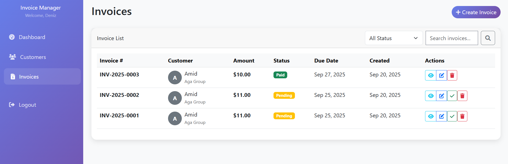

# 🧾 Invoice & Customer Management System

A comprehensive Laravel 10 application for managing customers and invoices with modern UI, PDF generation, and analytics dashboard.

## ✨ Features

### 🔐 Authentication & Security
- **Laravel Breeze** authentication system
- Pre-seeded admin user
- Protected routes with middleware
- CSRF protection on all forms

### 👥 Customer Management
- Complete CRUD operations
- Search functionality
- Email validation
- Company information tracking
- Customer statistics

### 📄 Invoice Management
- Auto-generated invoice numbers (INV-2025-0001 format)
- Customer association
- Status tracking (Paid/Pending)
- Due date management
- Overdue invoice detection
- PDF export functionality
- Advanced filtering and search

### 📊 Analytics Dashboard
- Total revenue tracking
- Paid vs Pending statistics
- Monthly revenue charts
- Invoice status distribution
- Recent invoices overview
- Interactive Chart.js visualizations

### 🎨 Modern UI/UX
- Bootstrap 5 responsive design
- Gradient sidebar navigation
- Professional card layouts
- Interactive hover effects
- Mobile-friendly interface
- Font Awesome icons

## 🚀 Quick Start

### Prerequisites
```bash
PHP 8.1+
Composer
Node.js & NPM
MySQL/MariaDB
```

### Installation

1. **Clone the repository**
```bash
git clone https://github.com/your-username/invoice-app.git
cd invoice-app
```

2. **Install PHP dependencies**
```bash
composer install
```

3. **Install Node dependencies**
```bash
npm install
```

4. **Environment setup**
```bash
cp .env.example .env
php artisan key:generate
```

5. **Configure database** (edit `.env`)
```env
DB_CONNECTION=mysql
DB_HOST=127.0.0.1
DB_PORT=3306
DB_DATABASE=invoice_app
DB_USERNAME=your_username
DB_PASSWORD=your_password
```

6. **Run migrations and seeders**
```bash
php artisan migrate
php artisan db:seed
```

7. **Build assets**
```bash
npm run build
```

8. **Start development server**
```bash
php artisan serve
```

Visit `http://localhost:8000` and login with:
- **Email:** admin@example.com
- **Password:** Admin123

## 📂 Project Structure

```
invoice-app/
├── 📁 app/
│   ├── 📁 Http/Controllers/
│   │   ├── 🎮 CustomerController.php      # Customer CRUD operations
│   │   ├── 🎮 InvoiceController.php       # Invoice management & PDF
│   │   └── 🎮 DashboardController.php     # Analytics & statistics
│   ├── 📁 Models/
│   │   ├── 👤 Customer.php                # Customer model & relationships
│   │   └── 🧾 Invoice.php                 # Invoice model & auto-numbering
│   └── 📁 Http/Requests/                  # Form validation requests
├── 📁 database/
│   ├── 📁 migrations/                     # Database schema
│   └── 📁 seeders/                        # Test data & admin user
├── 📁 resources/views/
│   ├── 🎨 layouts/app.blade.php          # Main layout template
│   ├── 📊 dashboard.blade.php            # Analytics dashboard
│   ├── 📁 customers/                      # Customer views
│   └── 📁 invoices/                       # Invoice views & PDF template
└── 🛣️ routes/web.php                      # Application routes
```

## 🎯 Key Features Demo

### Dashboard Analytics
- 📈 Real-time revenue tracking
- 🥧 Interactive pie charts for invoice status
- 📊 Monthly revenue line charts
- 🔢 Key performance indicators

### Customer Management
- ➕ Add customers with validation
- 🔍 Search by name, email, or company
- 📊 View customer statistics
- 🔗 Link to customer invoices

### Invoice Operations
- 🆕 Create invoices with auto-numbering
- 💰 Amount and status tracking
- 📅 Due date management
- ⚠️ Overdue detection
- 📄 Professional PDF generation
- 🔍 Advanced filtering options

## 🗄️ Database Schema

### Customers Table
```sql
id              BIGINT PRIMARY KEY
name            VARCHAR(255) NOT NULL
email           VARCHAR(255) UNIQUE NOT NULL
phone           VARCHAR(20) NULLABLE
company_name    VARCHAR(255) NULLABLE
address         TEXT NULLABLE
created_at      TIMESTAMP
updated_at      TIMESTAMP
```

### Invoices Table
```sql
id              BIGINT PRIMARY KEY
customer_id     BIGINT FOREIGN KEY
amount          DECIMAL(10,2) NOT NULL
status          ENUM('Paid','Pending') DEFAULT 'Pending'
due_date        DATE NOT NULL
invoice_number  VARCHAR(50) UNIQUE NOT NULL
description     TEXT NULLABLE
created_at      TIMESTAMP
updated_at      TIMESTAMP
```

## 🔧 Configuration

### PDF Configuration
The application uses `barryvdh/laravel-dompdf` for PDF generation. Configuration available in `config/dompdf.php`.

### Auto Invoice Numbering
Invoices are automatically numbered using the format: `INV-YYYY-NNNN`
- INV: Prefix
- YYYY: Current year
- NNNN: Incremental number (padded to 4 digits)

## 🛠️ API Endpoints (Optional)

The application includes optional JSON API endpoints:

```
GET /api/customers          # List customers
GET /api/customers/{id}     # Get customer details
GET /api/invoices          # List invoices (with filters)
GET /api/invoices/{id}     # Get invoice details
GET /api/dashboard-stats   # Get dashboard statistics
```

All API endpoints require authentication using Laravel Sanctum.

## 🎨 Customization

### Styling
- Primary color scheme uses gradients from `#667eea` to `#764ba2`
- Bootstrap 5 utility classes for responsive design
- Custom CSS for enhanced visual effects

### Adding New Features
1. Create new migrations: `php artisan make:migration create_table_name`
2. Create models: `php artisan make:model ModelName`
3. Create controllers: `php artisan make:controller ControllerName`
4. Add routes to `routes/web.php`
5. Create corresponding Blade templates

## 🧪 Testing

### Run Tests
```bash
php artisan test
```

### Seed Test Data
```bash
php artisan db:seed --class=TestDataSeeder
```

## 🚀 Production Deployment

### Optimization Commands
```bash
php artisan config:cache
php artisan route:cache
php artisan view:cache
composer install --optimize-autoloader --no-dev
```

### Environment Setup
```bash
php artisan key:generate
php artisan migrate --force
```

## 📋 Default Test Data

The seeder creates:
- **5 sample customers** with realistic business data
- **8 sample invoices** with various statuses and dates
- **1 admin user** (admin@example.com / Admin123)

## 🔒 Security Features

- ✅ CSRF protection on all forms
- ✅ Input validation and sanitization
- ✅ SQL injection prevention with Eloquent ORM
- ✅ Authentication middleware on protected routes
- ✅ Rate limiting on API endpoints
- ✅ Password hashing with bcrypt

## 🤝 Contributing

1. Fork the repository
2. Create a feature branch (`git checkout -b feature/amazing-feature`)
3. Commit your changes (`git commit -m 'Add amazing feature'`)
4. Push to the branch (`git push origin feature/amazing-feature`)
5. Open a Pull Request

## 📝 License

This project is open-sourced software licensed under the [MIT license](https://opensource.org/licenses/MIT).

## 🆘 Troubleshooting

### Common Issues

#### Database Connection Error
```bash
# Check database credentials in .env
# Ensure MySQL service is running
sudo systemctl start mysql
```

#### PDF Generation Issues
```bash
# Clear cache and config
php artisan cache:clear
php artisan config:clear

# Ensure dompdf is properly installed
composer require barryvdh/laravel-dompdf
```

#### Permission Errors
```bash
# Set proper permissions
chmod -R 775 storage bootstrap/cache
php artisan storage:link
```

#### Assets Not Loading
```bash
# Rebuild assets
npm run build

# For development
npm run dev
```

## 📞 Support

For support or questions:
- Create an issue on GitHub
- Check the [Laravel Documentation](https://laravel.com/docs)
- Review the [Bootstrap 5 Documentation](https://getbootstrap.com/docs/5.0)

## 🏗️ Built With

- **[Laravel 10](https://laravel.com/)** - PHP web application framework
- **[Laravel Breeze](https://laravel.com/docs/10.x/starter-kits#laravel-breeze)** - Authentication scaffolding
- **[Bootstrap 5](https://getbootstrap.com/)** - CSS framework
- **[Chart.js](https://www.chartjs.org/)** - JavaScript charting library
- **[DomPDF](https://github.com/barryvdh/laravel-dompdf)** - PDF generation
- **[Font Awesome](https://fontawesome.com/)** - Icon library
- **[MySQL](https://www.mysql.com/)** - Database management system

## 📊 Screenshots

### Dashboard


### Customer Management


### Invoice Management



### PDF Invoice


## 🎯 Future Enhancements

- [ ] Email notifications for overdue invoices
- [ ] Multi-currency support
- [ ] Recurring invoice templates
- [ ] Payment gateway integration
- [ ] Advanced reporting and analytics
- [ ] Mobile application
- [ ] Multi-tenant support
- [ ] Invoice templates customization
- [ ] Backup and restore functionality
- [ ] Advanced user roles and permissions

## 📈 Performance Optimizations

- Database indexing on frequently queried columns
- Eager loading relationships to prevent N+1 queries
- Caching for dashboard statistics
- Optimized pagination for large datasets
- Compressed assets for faster loading

## 🌍 Internationalization

The application is ready for internationalization with Laravel's localization features. Language files can be added to the `resources/lang/` directory.

## 🔍 Code Quality

- PSR-12 coding standards
- Comprehensive form validation
- Error handling and logging
- Clean architecture patterns
- Documented code with PHPDoc

---

## 📚 Learning Resources

If you're new to Laravel or want to extend this project, check out these resources:

- [Laravel Documentation](https://laravel.com/docs)
- [Laravel Bootcamp](https://bootcamp.laravel.com/)
- [Laracasts](https://laracasts.com/)
- [Laravel News](https://laravel-news.com/)

---

**Happy Coding! 🎉**

Made with ❤️ using Laravel

---

> **Note:** This is a demonstration project showcasing modern Laravel development practices. Feel free to use it as a starting point for your own invoice management system or as a learning resource.